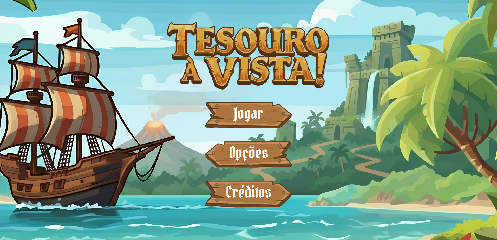

# :video_game: Tesouro à Vista

Um quiz educativo, onde os jogadores devem testar seus conhecimentos para avançar e vencer. Este projeto foi desenvolvido como componente curricular para a matéria WEB I na Universidade do Estado da Bahia (UNEB).

-----

## :rocket: Acesso ao Jogo (Deploy)

Você pode jogar a versão mais recente diretamente no seu navegador através do link do GitHub Pages:

### [:arrow_right: Clique aqui para Jogar\!](https://mateus-nepomuceno.github.io/Tesouro-a-Vista/)


-----

## :rocket: Prévia



## :hammer_and_wrench: Tecnologias Utilizadas

Este projeto foi construído utilizando apenas tecnologias web fundamentais:

  * **HTML5**
  * **CSS3**
  * **JavaScript**
  * **JSON**

-----

## :file_folder: Estrutura de Arquivos

A organização do projeto segue a seguinte estrutura:

```
/
├── index.html          
├── README.md           
├── LICENSE             
├── game_assets/
|   └── assets.webp        
└── components/
    ├── data/
    │   └── perguntas.json 
    ├── scripts/
    │   └── index.js
    └── styles/
        ├── creditos.css
        ├── jogar.css
        ├── index.css
        ├── quiz.css
        ├── tabuleiro.css
        └── opcoes.css
```

-----

## :running: Como Rodar Localmente

Se você quiser rodar o projeto no seu próprio computador:

1.  Clone este repositório:
    ```bash
    git clone https://github.com/Mateus-Nepomuceno/Tesouro-a-Vista.git
    ```
2.  Navegue até a pasta do projeto:
    ```bash
    cd Tesouro-a-Vista
    ```
3.  Abra o arquivo `index.html` no seu navegador.

-----

## :bust_in_silhouette: Autores

* [Marta Gisele Barreto](https://github.com/MartaGiseleBarreto) - **Gestão** :briefcase:
* [Luiza Moraes](https://github.com/luizabttc) - **Designer** :pencil:
* [Nairana dos Anjos](https://github.com/anjos536) - **Designer** :pencil:
* [Tiago Correia](https://github.com/TiagoCorreiaB) - **Programador** :computer:
* [Mateus Nepomuceno](https://github.com/Mateus-Nepomuceno) - **Programador** :computer:
